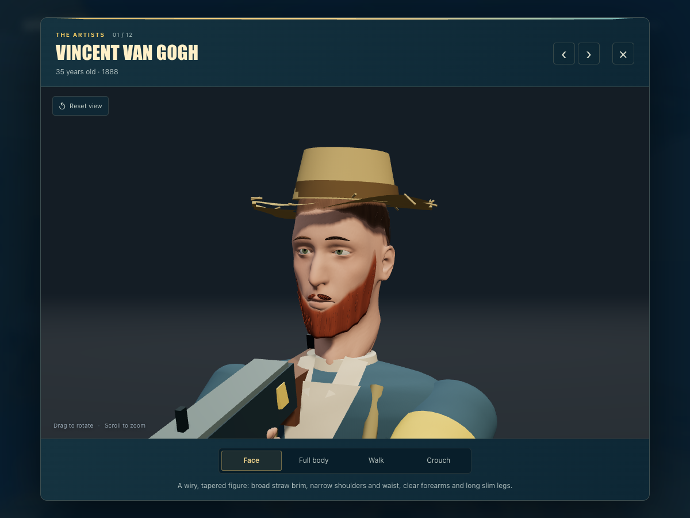

# 梵谷小鎮大作戰

**十二位畫家，兩支死對頭，一場顏料戰。**

在梵谷小鎮打的六對六瀏覽器射擊遊戲。挑一位畫家、拿起他的專屬武器，把咖啡館街道變成三分鐘的恩怨現場。

免安裝 · 桌機鍵盤滑鼠 · 單人對電腦


帶著五個隊友打對面那一隊。**先擊殺 20 次**，或三分鐘結束時分數較高的一方獲勝。兩秒復活，不會讓你等太久。衝刺、滑鏟、丟顏料彈，再在牆上留下自己的塗鴉。

## 挑一位畫家

加入 **黃屋幫** 或 **獨立派**。每位畫家都有專屬主武器、一把手槍、自己的塗鴉和一支勝利舞。選好按 **開打**，三二一倒數期間可以先轉頭看看場地。


## 認識這些畫家

點 **查看畫家** 可以細看。工作室用的就是遊戲裡的同一批模型，有臉部、全身、行走和蹲下四種視角。

<p align="center">
  
</p>

| 武器 | 黃屋幫 | 獨立派 |
| --- | --- | --- |
| 普羅旺斯 突擊步槍 | 梵谷、席涅克 | 莫內、畢沙羅 |
| 北風 衝鋒槍 | 高更、羅特列克 | 雷諾瓦、卡薩特 |
| 收割者 霰彈槍 | 塞尚 | 竇加 |
| 夜曲 精準步槍 | 秀拉 | 莫利索 |

十二個人的體型、臉、衣服、移動重量、塗鴉和舞蹈都不一樣。**畫家是真的，隊伍、武器、服裝和恩怨全是虛構的。** 身形比例屬於角色設計，不是考據過的實際尺寸。出處可以看 [藝術世界設定](docs/ART-WORLD.md)、[角色筆記](docs/characters/) 和 [塗鴉說明](docs/ARTIST-TAGS.md)。

## 操作

| 按鍵 | 動作 |
| --- | --- |
| W / A / S / D；滑鼠 | 移動；轉頭 |
| 滑鼠左鍵；按住右鍵 | 開火；舉槍瞄準 |
| Shift + 前進；空白鍵 | 衝刺；跳躍 |
| 按住 C 或 Ctrl | 蹲下；衝刺中蹲下會滑鏟 |
| R；1 / 2 或滾輪 | 換彈；切換主武器與手槍 |
| B；I；V | 切換射擊模式；檢視武器；近戰 |
| Q / G；站著不動按住 H | 煙霧／顏料彈；治療 |
| T；J | 噴上你的塗鴉；跳勝利舞 |
| 按住 Tab；Esc | 計分板；暫停／繼續 |

蹲下會同時收緊實際彈道散布和準心。衝刺和滑鏟時不能開火。隊友會擋子彈但不會被誤傷。自己的顏料彈會炸到自己。開火或其他攻擊動作會解除重生保護。

重生時有 100 點血和 50 點護甲。每次擊殺最多回 10 點血；四點五秒沒受傷也會自動回血。每位畫家一把主武器加一把手槍；武器、彈藥和技能次數都在重生時補滿。

設定裡可以調靈敏度、音量和筆觸畫質。切到別的程式會自動暫停並清掉按住的鍵。如果瀏覽器放掉滑鼠，點一下畫面上的提示就會重新鎖定。**手機觸控和線上多人都沒做**，這是一個單人對電腦的遊戲。

## 在自己電腦上玩

需要 Node.js 20 以上，以及一台支援硬體加速 WebGL 的桌機瀏覽器，加鍵盤滑鼠。

```sh
git clone https://github.com/austinisadoge/gogh-town.git
cd gogh-town
npm start
```

打開 **http://127.0.0.1:8967/**。執行環境和模型都已經打包在裡面，光是要玩不必先安裝套件。想換連接埠用 `PORT=8968 npm start`。第一次線上載入大約要抓 36 MB 的素材，之後可以吃瀏覽器快取。

## 開發與部署

```sh
npm ci
npm test
npm run build
```

`dist/` 是一包可以直接丟到任何靜態主機的網站。打包出來只有瀏覽器要用的檔案和授權聲明，開發工具和原始場景不會進去。

[開發筆記](docs/DEVELOPMENT.md) 說明架構和角色工具。GLB 模型和肖像都已經放進版控。Blender 產生器和官方 CC0 人體資料也一併附上，想重新產生模型或編輯 `.blend` 場景都可以；單純要跑遊戲不需要 Blender。

## 授權與來源

這個專案改自 [petergpt/gogh-strike](https://github.com/petergpt/gogh-strike)（MIT 授權），本版本做了全面中文化、更名與品牌調整。

程式與原創美術採 [MIT 授權](LICENSE)。Three.js 保留它自己的 MIT 聲明；MakeHuman 的人體基礎與變形資料為 CC0。詳見 [第三方聲明](THIRD_PARTY_NOTICES.md) 與 [素材來源](PROVENANCE.md)。
